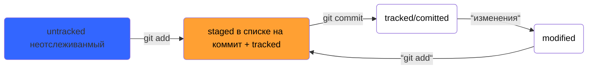

# Проект для прохождения курса GIT на Яндекс практикуме  
## Список основных команд GIT:    
1. **pwd** - показывает рабочую папку.  
2. **cd [путь к папке]** - команда смены папки  
3. **cd [~]** - перейти в домашнюю директорию  
4. **ls** - отоброзит содержимое директории  
5. **touch [имя файла]** - создаёт новый файл  
6. **mkdir [имя папки]** - сщздаёт новую папку  
7. **cp [что копируем] [путь куда копируем]** - команда копирования  
8. **mv [что переместить] [путь куда переместить]** - команда переноса  
9. **cat [имя файла]** - открывает текстовый файт для чтения  
10. **rm [имя файла]** - удаляет файл  
## Хеш — идентификатор коммита ##  
	- У каждого коммита есть свой уникальный хеш, который преобразуеся с помощью алгоритма SHA-1.  
	- Хеш хранится в папке .git  
## Логировани
1. **git** **log** - выводит полный лог  
	- хеш коммита  
	- автор коммита  
	- дата и время создания коммита  
	- сообщение коммита  
2. **git** **log** — **online** - выводит сокращенныё лог  
	- показывает сокращенный хеш и сообщение в одной строке  

## Файл Head  
	- Файл Head один из служебных файлов папки .git  
	- В файле хранится ссылка на файл, в котором записан Хеш на последний коммит  
## Схема статусов в GIT

